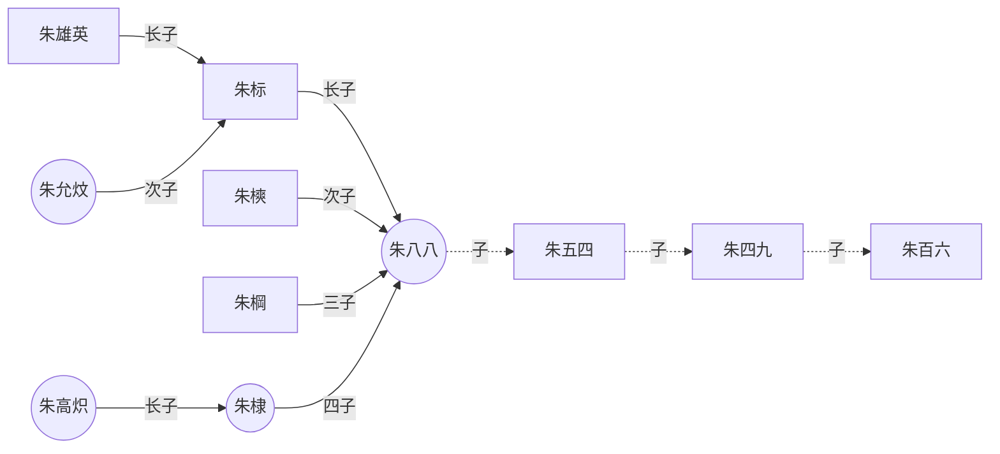
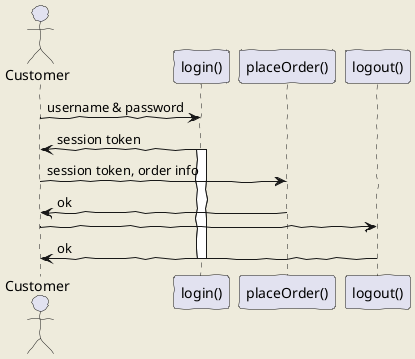

https://google.com

<button onclick='alert("hello")'>Click me</button>

```text
hello plain text
```

```rust
fn main() {
    println!("Hello, world!");
}
```




@startuml
Bob -> Alice : hello
@enduml




- [x] xxx
